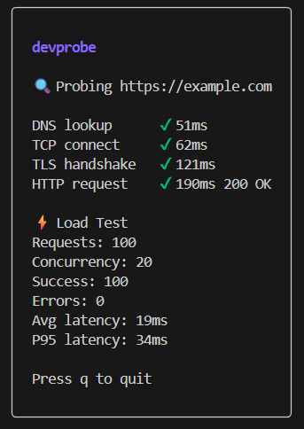

# devprobe⚡

**devprobe** is a fast, developer-friendly CLI tool to **probe**, **measure**, and **load test** HTTP services.

It helps you understand *where time is spent* — DNS, TCP, TLS, HTTP — and how your service behaves under load.

---

## Features

### Network Probing
- DNS lookup time
- TCP connection time
- TLS handshake time
- HTTP request latency & status
- Automatic retries
- Request timeouts

### Load Testing
- Configurable concurrency
- Total request count
- Success & error counts
- Average latency
- P95 latency

---

## Installation

### Build from source

```bash
git clone https://github.com/piyushdev04/devprobe.git

cd devprobe

go build -o devprobe ./cmd

./devprobe -tui -timeout 3s -retries 2 -c 20 -n 100 https://example.com
```

---
## How it works
1. Input Parsing
- Reads the target URL and optional flags: concurrency, total requests, timeout, retries.

2. Context Creation
- Creates a context.Context with a timeout to control the maximum duration of each probe or request.

3. Concurrent Probes
- Launches goroutines for each probe:
    - DNS lookup
    - TCP connection
    - TLS handshake
    - HTTP request
- Each probe runs concurrently and independently.

4. Retries

- Each probe uses a retry mechanism.
- On failure, it automatically retries up to the configured number of attempts.

5. Time Measurement
- Each probe measures elapsed time using a utility function:
    - DNS → time to resolve hostname
    - TCP → time to establish connection
    - TLS → time to complete handshake
    - HTTP → time to receive full response

6. Result Collection
- All probe results are sent through a channel.
- Main routine collects and sorts them by execution order for logical output.

7. Load Testing
- Spawns a worker pool with size = concurrency.
- Sends total requests to the target URL in parallel.
- Measures latencies, counts successes, and errors.

8. Metrics Computation
- After load test completes:
    - Average latency = sum of latencies ÷ total requests
    - P95 latency = 95th percentile from sorted latency list
    - Success / Error counts are calculated

9. Output
- Probe times, load test stats, and derived metrics are returned for display or further processing.

---
## THANKS FOR READING!!!❄️